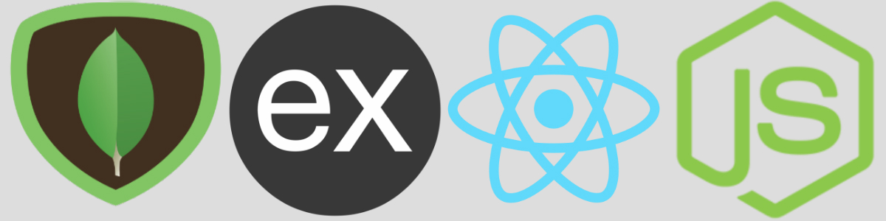

# MERN Boilerplate &middot; [](https://www.npmjs.com/package/npm) [](http://makeapullrequest.com) [](https://github.com/your/your-project/blob/master/LICENSE)
> Build MERN apps with ease

Boilerplate for developing apps with the MERN stack (Mongo, Express, React, and Node).

By: [Patrick Rivera](mailto:patrick.x.rivera@gmail.com)

[patrickrivera.io](https://patrickrivera.io)


## Getting Started

Clone down the repo and move into the directory.
```shell
git clone https://github.com/pxr13/mern-boilerplate && cd mern-boilerplate
```

Install and run the server:
```shell
npm i && npm run dev
```

In a new tab, install and run the client:
```shell
cd client/ && npm i && npm start
```
You should now be taken to http://localhost:3000 and see the home screen!

## Deploying to Heroku

[Install](https://devcenter.heroku.com/articles/heroku-cli) the heroku cli if you haven't already.

Once installed, create a new heroku app:
```shell
heroku create
```

Then push your repo to heroku:
```shell
git push heroku master
```

Once your repo has been pushed, visit the heroku link generated from the last command.

## Contributing

Contributing
------------

 1. **Fork** the repo on GitHub
 2. **Clone** the project to your own machine
 3. **Commit** changes to your own branch
 4. **Push** your work back up to your fork
 5. Submit a **Pull request** so we can review your changes

NOTE: Be sure to merge the latest from "upstream" before making a pull request!
